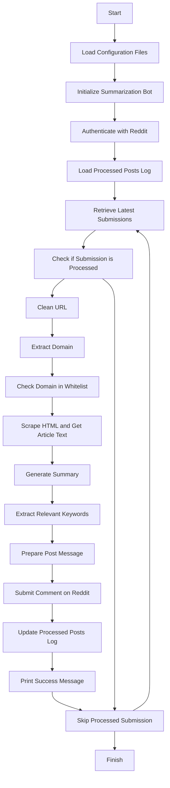
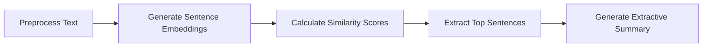

# Reddit News Summarization Bot

A reddit bot that can retrieve articles from portuguese news outlets to generate an **extractive summary** and perform **keyword extraction**.
It leverages **BERT SentenceTransformers** to generate input sequence embeddings and uses cosine similarity to calculate the similarity between sentence embeddings which allows us to identify the most important sentences in the document. This approach allows for an extractive summarization technique where the summary consists of the most relevant and representative sentences from the original text.

## Overview - Bot execution process


## Sumarization pipeline

- **Preprocessing**: Removing any unwanted words or phrases that the scraper may have retrieved in the article text and tokenize the text in sentences.
- **Generate Sentence Embeddings**: Pass the sentences through a sentence transformer model to generate the embeddings.
- **Calculate Similarity Scores**: Perform the similarity score calculation between sentence embeddings pairs using cosine similarity
- **Extract Top Sentences**: Calculate importance scores based on similarity matrix and select top sentences for the summary
- **Generate Extractive Summary**: Concatenate top summary sentences from previous node to create the summary.
## Usage

To use the Summarization Bot, follow these steps:

1. Clone the repository:
```bash
git clone https://github.com/bernardopimenta21/RedditSummarizerBot.git
```

2. Install the required dependencies:
```bash
pip install -r requirements.txt
```

3. Configure the bot:
Create in the folder conf/local/**globals.yml**, this is where the reddit API information is store, it should follow the structure:
```yaml
REDDIT_USERNAME : ""
REDDIT_PASSWORD : ""
APP_ID : ""
APP_SECRET : ""
USER_AGENT : ""
SUBREDDITS : [""]
```
Edit the file conf/**parameters.yml**:
```yaml
subreddits : [""]
whitelist : [""]
sentence_transfomer : ""
num_sentences : 
num_posts : 
SUBREDDITS : 
```
 where:
- subreddits: is a list of subreddits to search for articles
- whitelist: is the list of whitelisted news websites
- sentence_transfomer: the Hugging face model to use, currently "distilbert-base-nli-stsb-mean-tokens" is employed
- num_sentences: number of sentences that the summary will have
- num_posts: number of posts of each subreddits new page to search for news articles in each run

4. Run the bot execution script:
```bash
python sum_bot.py
```
Alternatively it is possible to run each module individually, to perform summarization and keyword extraction, independently of the bot:
```bash
python scraper.py
python summarization.py
```
